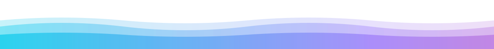

<div align="center">



<br/>

 perfect."/>

<br/><br/>

<a href="https://github.com/TsotneIvanashvili"></a>
<a href="https://github.com/TsotneIvanashvili/Tsotne"></a>


</div>


## ⚡ About me



<!--
## 🛠️ Tech stack

Uncomment and list ONLY tools you have actually shipped something with.
Icon ids: https://github.com/tandpfun/skill-icons#icons-list

<p align="center">
  
</p>
-->

<!--
## 🚀 Projects

| Project | What it does | Stack |
| ------- | ------------ | ----- |
| [name](https://github.com/TsotneIvanashvili/repo) | One sentence: the problem it solves. | Tech |
-->


## 🧭 Currently

- 🔭 Building things and putting the source code here.
- 🌱 Learning in public: every repo is a step up.
- 🎯 Goal: ship one more thing than yesterday.

<details>
<summary><b>🛠️ How this README is built</b></summary>

<br/>

Every animation is a hand-built, self-hosted SVG in [`assets/`](assets), made by
[`scripts/build_assets.py`](scripts/build_assets.py). That means:

- **No third-party widgets** that get rate-limited and show broken images.
- **No external fonts or scripts.** It renders the same everywhere GitHub shows images.
- **Respects `prefers-reduced-motion`.** Animations turn off and the final state shows.

To change the text, edit the `CONFIG` block and run:

```bash
python3 scripts/build_assets.py
```

</details>


